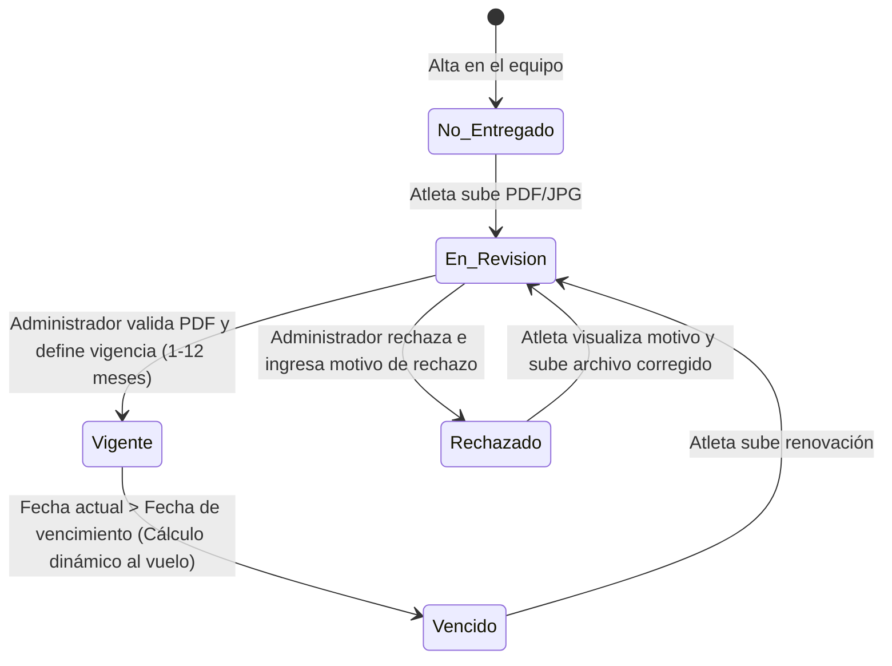

# Ciclo de Vida del Apto Médico (Aprobación Relacional)

El apto médico tiene un estado de aprobación **relacional** (por membresía). Aunque el atleta sube el documento de forma global en su perfil, cada administrador de club evalúa y audita de forma independiente el certificado para su propia institución, determinando su vigencia de 1 a 12 meses.

