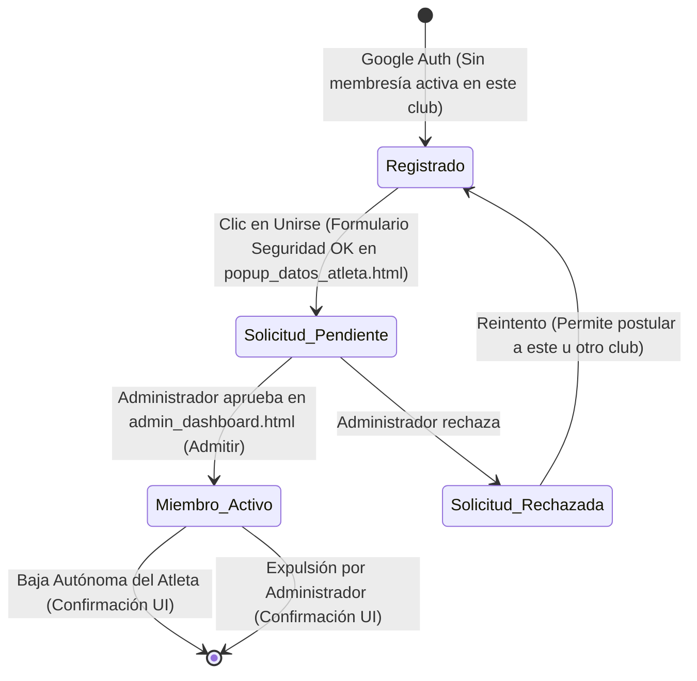

# Ciclo de Vida de la Membresía (Relación Atleta-Club)

Un usuario puede pertenecer a varios clubes en paralelo como atleta. Por lo tanto, este ciclo de vida se evalúa de manera independiente para cada relación específica entre un Atleta y un Club. Además, el mismo usuario puede tener roles administrativos en otros clubes.

