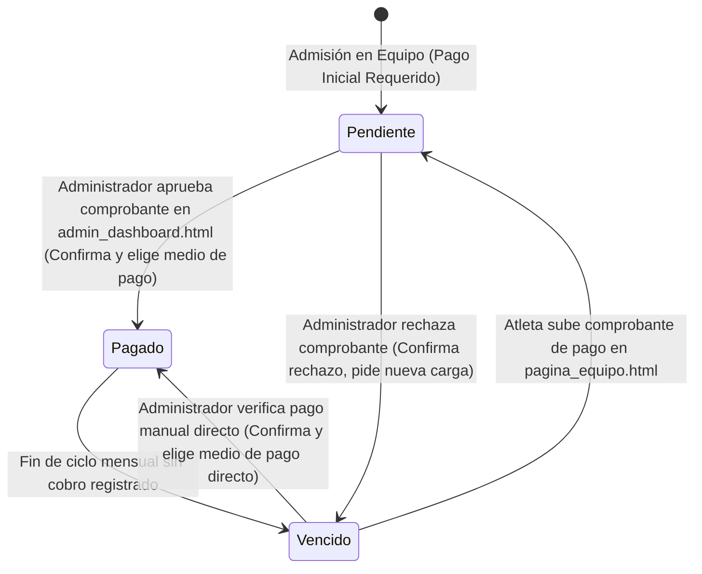

# Ciclo de Vida de la Suscripción (Pagos)

Los estados de cobro mensuales se definen de manera particular para cada atleta por su membresía en un club. Los estados posibles son **Pagado**, **Vencido** y **Pendiente** (de verificación).

