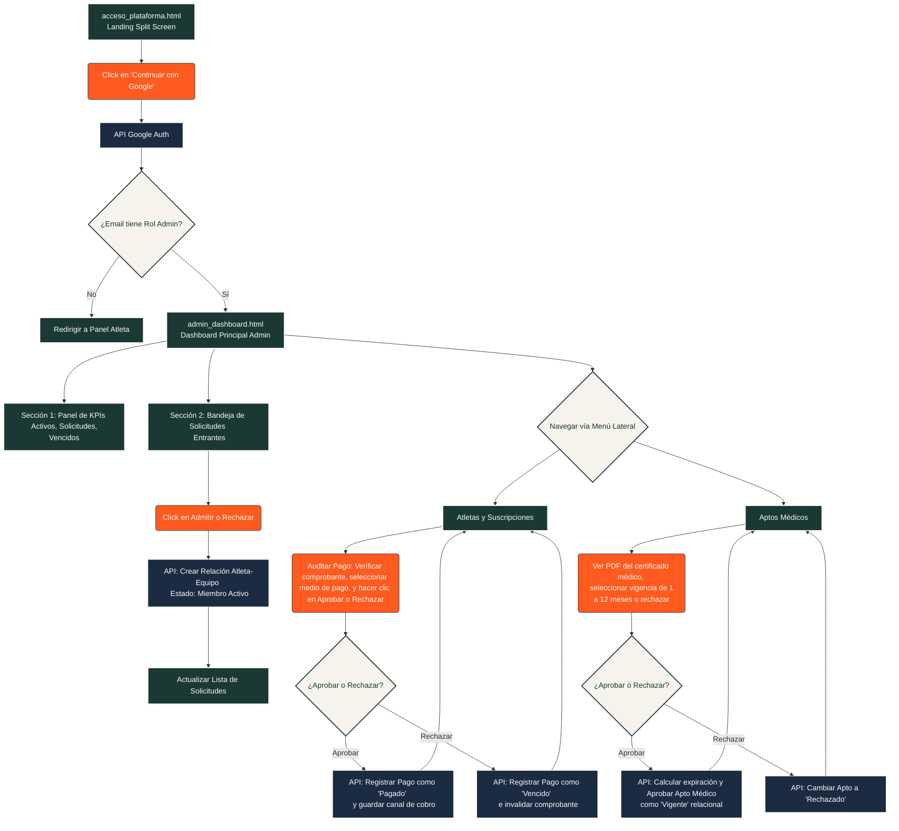

```mermaid
graph TD
    classDef pantalla fill:#1A3834,stroke:#FBFAF4,stroke-width:2px,color:#FBFAF4;
    classDef accion fill:#FF5A1F,stroke:#1A3834,stroke-width:1px,color:#FBFAF4;
    classDef decision fill:#F5F3EB,stroke:#1A3834,stroke-width:2px,color:#1A3834;
    classDef sistema fill:#1A2B42,stroke:#FBFAF4,stroke-width:1px,color:#FBFAF4;

    A[acceso_plataforma.html <br> Landing Split Screen]:::pantalla --> B(Click en 'Continuar con Google'):::accion
    B --> C[API Google Auth]:::sistema
    C --> D{¿Email tiene Rol Admin?}:::decision
    
    D -- No --> E[Redirigir a Panel Atleta]:::pantalla
    D -- Sí --> F[admin_dashboard.html <br> Dashboard Principal Admin]:::pantalla
    
    F --> G[Sección 1: Panel de KPIs <br> Activos, Solicitudes, Vencidos]:::pantalla
    F --> H[Sección 2: Bandeja de Solicitudes <br> Entrantes]:::pantalla
    
    H --> I(Click en Admitir o Rechazar):::accion
    I --> J[API: Crear Relación Atleta-Equipo <br> Estado: Miembro Activo]:::sistema
    J --> K[Actualizar Lista de Solicitudes]:::pantalla
    
    F --> L{Navegar vía Menú Lateral}:::decision
    L --> L1[Atletas y Suscripciones]:::pantalla
    L --> L2[Aptos Médicos]:::pantalla
    
    L1 --> M(Auditar Pago: Verificar comprobante, seleccionar medio de pago, y hacer clic en Aprobar o Rechazar):::accion
    M --> M_API{¿Aprobar o Rechazar?}:::decision
    M_API -- Aprobar --> M_OK[API: Registrar Pago como 'Pagado' <br> y guardar canal de cobro]:::sistema
    M_API -- Rechazar --> M_NO[API: Registrar Pago como 'Vencido' <br> e invalidar comprobante]:::sistema
    M_OK --> L1
    M_NO --> L1
    
    L2 --> N(Ver PDF del certificado médico, <br> seleccionar vigencia de 1 a 12 meses o rechazar):::accion
    N --> N_API{¿Aprobar o Rechazar?}:::decision
    N_API -- Aprobar --> N_OK[API: Calcular expiración y <br> Aprobar Apto Médico como 'Vigente' relacional]:::sistema
    N_API -- Rechazar --> N_NO[API: Cambiar Apto a 'Rechazado']:::sistema
    N_OK --> L2
    N_NO --> L2
```
