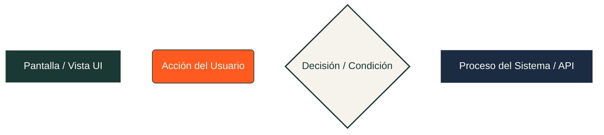

```mermaid
graph TD
    classDef pantalla fill:#1A3834,stroke:#FBFAF4,stroke-width:2px,color:#FBFAF4;
    classDef accion fill:#FF5A1F,stroke:#1A3834,stroke-width:1px,color:#FBFAF4;
    classDef decision fill:#F5F3EB,stroke:#1A3834,stroke-width:2px,color:#1A3834;
    classDef sistema fill:#1A2B42,stroke:#FBFAF4,stroke-width:1px,color:#FBFAF4;

    Pantalla[Pantalla / Vista UI]:::pantalla
    Accion(Acción del Usuario):::accion
    Decision{Decisión / Condición}:::decision
    Sistema[Proceso del Sistema / API]:::sistema
```
