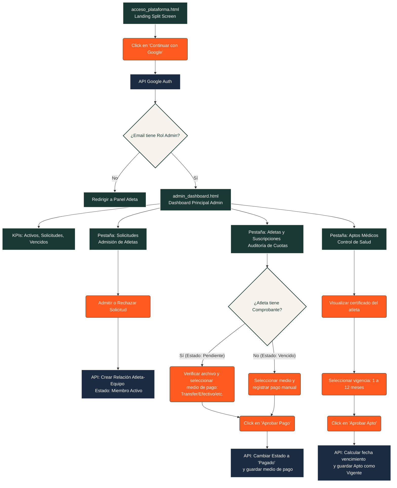

# Stride — User Flows (Flujos de Usuario)

Este documento describe detalladamente los flujos de usuario (User Flows) para la plataforma de gestión deportiva **Stride**. Está dividido en dos rutas principales correspondientes a los dos roles del sistema: **Ruta A (El Recorrido del Atleta)** y **Ruta B (El Recorrido del Administrador)**.

---

## 🛠 Leyenda de Simbología en Diagramas

Los diagramas utilizan la siguiente codificación visual y de comportamiento para representar el flujo lógico del software:


---

## 🏃‍♂️ Ruta A: El Recorrido del Atleta

Describe el viaje del atleta desde su registro rápido y la postulación a un equipo, hasta su vida activa dentro del equipo, carga de comprobantes de pago y documentación médica.

### 1. Ficha Técnica (Ruta A)

| Campo | Detalle |
| :--- | :--- |
| **Actor Principal** | Atleta (Nuevo o Existente, con capacidad de unirse a múltiples clubes) |
| **Precondición** | El atleta posee una cuenta de Google. |
| **Postcondición** | El atleta es miembro activo del equipo, accede a pestañas de gestión, sube comprobantes de pago y actualiza su apto médico. |
| **Objetivo** | Unirse a uno o varios equipos de entrenamiento y gestionar sus pagos y aptos de manera descentralizada por club. |

### 2. Diagrama de Flujo (Ruta A)

```mermaid
graph TD
    classDef pantalla fill:#1A3834,stroke:#FBFAF4,stroke-width:2px,color:#FBFAF4;
    classDef accion fill:#FF5A1F,stroke:#1A3834,stroke-width:1px,color:#FBFAF4;
    classDef decision fill:#F5F3EB,stroke:#1A3834,stroke-width:2px,color:#1A3834;
    classDef sistema fill:#1A2B42,stroke:#FBFAF4,stroke-width:1px,color:#FBFAF4;

    A[acceso_plataforma.html <br> Landing Split Screen]:::pantalla --> B(Click en 'Continuar con Google'):::accion
    B --> C[API Google Auth]:::sistema
    C --> D{¿Usuario Registrado?}:::decision
    
    D -- No (Nuevo) --> E[API: Registrar Atleta <br> con Nombre e Email]:::sistema
    D -- Sí (Existente) --> F[API: Verificar Roles y Permisos]:::sistema
    
    E --> G[home_principal.html <br> Welcome Hub]:::pantalla
    F --> G
    
    G --> H(Click en 'Equipos'):::accion
    H --> I[explorador_equipos.html]:::pantalla
    
    I --> J(Click en 'Solicitar Unirse' a un Equipo):::accion
    J --> K{¿Datos de Seguridad <br> Completos?}:::decision
    
    K -- No --> L[Mostrar Modal <br> popup_datos_atleta.html]:::pantalla
    L --> M(Ingresar Teléfono, Nacimiento <br> y Contacto de Emergencia):::accion
    M --> N(Click en 'Guardar y Enviar'):::accion
    N --> O[API: Guardar Perfil y <br> Registrar Solicitud]:::sistema
    
    K -- Sí --> P[API: Registrar Solicitud]:::sistema
    
    O --> Q[explorador_equipos.html <br> Estado: Solicitud Enviada]:::pantalla
    P --> Q
    
    Q --> R{¿Aprobado por Admin <br> - Ruta B, Paso 3?}:::decision
    
    R -- Espera / No --> Q
    R -- Sí --> S[pagina_equipo.html <br> Panel de Club del Atleta]:::pantalla
    
    S --> T{Interactuar en el Equipo}:::decision
    T --> T1[eventos.html <br> Buscador de Eventos]:::pantalla
    T --> T2[dashboard_atleta.html <br> Pestaña: Mis tickets]:::pantalla
    T --> T3[dashboard_atleta.html <br> Pestaña: Mi perfil <br> (Datos Google, Seguridad, Apto)]:::pantalla
    T --> T4[pagina_equipo.html <br> Pestaña: Mi Suscripción]:::pantalla
    
    T3 --> U(Subir PDF/JPG de Apto Médico):::accion
    U --> V[API: Subir Archivo y <br> Actualizar Estado de Apto]:::sistema
    V --> W[Estado Apto: Pendiente de Revisión]:::pantalla

    T4 --> X(Subir comprobante de pago):::accion
    X --> Y[API: Guardar Comprobante <br> y cambiar estado de cuota]:::sistema
    Y --> Z[Estado Cuota: Pendiente]:::pantalla
```

### 3. Matriz de Pasos Detallada (Ruta A)

| Paso | Pantalla/Vista | Acción del Usuario | Proceso / Validación del Sistema | Pantalla Destino | Caminos Alternos / Errores |
| :---: | :--- | :--- | :--- | :--- | :--- |
| **1** | [acceso_plataforma.html](file:///c:/Users/pnm19/OneDrive/Documents/stride/Wireframes%20UI/acceso_plataforma.html) | Hace clic en "Continuar con Google". | Dispara el flujo de autenticación única de Google OAuth. | Proceso de autenticación | Si el usuario cancela la autenticación, regresa a [acceso_plataforma.html](file:///c:/Users/pnm19/OneDrive/Documents/stride/Wireframes%20UI/acceso_plataforma.html). |
| **2** | *Intermedio* | Otorga permisos en cuenta de Google. | **Roles:** Verifica el email en la base de datos para mapear sus roles (puede ser atleta en un club y administrador de otro). | [home_principal.html](file:///c:/Users/pnm19/OneDrive/Documents/stride/Wireframes%20UI/home_principal.html) | Si falla la conexión con la API de Google, redirige con un mensaje de error técnico. |
| **3** | [home_principal.html](file:///c:/Users/pnm19/OneDrive/Documents/stride/Wireframes%20UI/home_principal.html) | Hace clic en la opción "Equipos" del menú superior. | Carga los clubes y grupos deportivos disponibles en la plataforma. | [explorador_equipos.html](file:///c:/Users/pnm19/OneDrive/Documents/stride/Wireframes%20UI/explorador_equipos.html) | También puede navegar a su perfil general o buscador de eventos. |
| **4** | [explorador_equipos.html](file:///c:/Users/pnm19/OneDrive/Documents/stride/Wireframes%20UI/explorador_equipos.html) | Revisa los equipos disponibles y selecciona uno para unirse. | - | - | El atleta puede enviar solicitudes a múltiples equipos independientes en paralelo. |
| **5** | [explorador_equipos.html](file:///c:/Users/pnm19/OneDrive/Documents/stride/Wireframes%20UI/explorador_equipos.html) | Hace clic en "Solicitar Unirse". | Verifica si posee completos los datos de seguridad (teléfono, contacto de emergencia). | Decisión del sistema | Si tiene los datos, salta al **Paso 7**. |
| **6** | [popup_datos_atleta.html](file:///c:/Users/pnm19/OneDrive/Documents/stride/Wireframes%20UI/popup_datos_atleta.html) (Modal) | Ingresa teléfono, fecha de nacimiento y contacto de emergencia. | Valida formatos de los datos requeridos. | - | Si hay errores, resalta los campos no válidos. |
| **7** | [popup_datos_atleta.html](file:///c:/Users/pnm19/OneDrive/Documents/stride/Wireframes%20UI/popup_datos_atleta.html) (Modal) | Hace clic en "Guardar y Enviar". | Registra la solicitud de membresía vinculada a ese club específico en estado `Pendiente de Aprobación`. | [explorador_equipos.html](file:///c:/Users/pnm19/OneDrive/Documents/stride/Wireframes%20UI/explorador_equipos.html) | El botón se deshabilita mostrando "Solicitud Enviada". |
| **8** | [home_principal.html](file:///c:/Users/pnm19/OneDrive/Documents/stride/Wireframes%20UI/home_principal.html) | Accede una vez aprobada su solicitud. | Carga la vinculación activa y le permite ver la página del equipo en estado de pago inicial `PENDIENTE`. | [pagina_equipo.html](file:///c:/Users/pnm19/OneDrive/Documents/stride/Wireframes%20UI/pagina_equipo.html) | - |
| **9** | [pagina_equipo.html](file:///c:/Users/pnm19/OneDrive/Documents/stride/Wireframes%20UI/pagina_equipo.html) | Va a la pestaña "Mi Suscripción". | Carga el estado de cuota del mes (inicialmente `PENDIENTE`, requiere cargar comprobante). | Pestaña "Mi Suscripción" | - |
| **10** | [pagina_equipo.html](file:///c:/Users/pnm19/OneDrive/Documents/stride/Wireframes%20UI/pagina_equipo.html) | Sube un comprobante de transferencia o pago mensual. | Registra el archivo y cambia el estado de la cuota a `PENDIENTE` (esperando verificación de administración). | Vista de Suscripción | El estado cambia visualmente a "PENDIENTE" con un aviso. |
| **11** | [dashboard_atleta.html](file:///c:/Users/pnm19/OneDrive/Documents/stride/Wireframes%20UI/dashboard_atleta.html) (Mi perfil) | Sube un certificado médico PDF/JPG. | Sube el documento y actualiza el estado de apto de su perfil a `Pendiente de Revisión` para este club. | Perfil del Atleta | Si el archivo excede los límites, se muestra una alerta. |

---

## 💼 Ruta B: El Recorrido del Administrador (SaaS)

Describe el flujo de control para administradores deportivos de un club, enfocado en el inicio de sesión con Google, gestión de admisiones, cobros con medios de pago y validación de aptos con vencimiento configurable.

### 1. Ficha Técnica (Ruta B)

| Campo | Detalle |
| :--- | :--- |
| **Actor Principal** | Administrador de un Club (Un usuario puede administrar un club y ser atleta en otro) |
| **Precondición** | Registro de cuenta y rol de administración asignado al email de Google en base de datos. |
| **Postcondición** | Gestiona solicitudes de membresía, audita aptos médicos configurando meses de vigencia, y aprueba comprobantes de pago seleccionando el medio correspondiente. |
| **Objetivo** | Controlar la operación del club, cuotas mensuales y estado de aptos médicos de sus atletas. |

### 2. Diagrama de Flujo (Ruta B)



### 3. Matriz de Pasos Detallada (Ruta B)

| Paso | Pantalla/Vista | Acción del Usuario | Proceso / Validación del Sistema | Pantalla Destino | Caminos Alternos / Errores |
| :---: | :--- | :--- | :--- | :--- | :--- |
| **1** | [acceso_plataforma.html](file:///c:/Users/pnm19/OneDrive/Documents/stride/Wireframes%20UI/acceso_plataforma.html) | Hace clic en "Continuar con Google". | Dispara la autenticación unificada. Verifica el email en base de datos. | Proceso de autenticación | Si no es admin de ningún club, lo redirige al flujo de atleta por defecto. |
| **2** | [admin_dashboard.html](file:///c:/Users/pnm19/OneDrive/Documents/stride/Wireframes%20UI/admin_dashboard.html) | Ingresa al panel de administración de su club. | Carga estadísticas del club: Atletas activos, Solicitudes pendientes de ingreso y Suscripciones en mora. | [admin_dashboard.html](file:///c:/Users/pnm19/OneDrive/Documents/stride/Wireframes%20UI/admin_dashboard.html) | Si el usuario es administrador de varios clubes, se habilitará un selector de club en la cabecera. |
| **3** | [admin_dashboard.html](file:///c:/Users/pnm19/OneDrive/Documents/stride/Wireframes%20UI/admin_dashboard.html) (Solicitudes) | Hace clic en "Admitir" o "Rechazar" a un postulante (requiere confirmación). | Si aprueba, crea el registro de vinculación club-atleta. El atleta ingresa con estado de pago inicial `PENDIENTE`. | Solicitudes (Actualizada) | El atleta es notificado en la UI en su próxima sesión. |
| **4** | [admin_dashboard.html](file:///c:/Users/pnm19/OneDrive/Documents/stride/Wireframes%20UI/admin_dashboard.html) (Atletas) | Revisa la tabla de cuotas mensuales. | Muestra atletas en estados: `Pagado`, `Vencido` o `Pendiente`. | Atletas y Suscripciones | El admin puede filtrar por estado para agilizar la gestión. |
| **5** | [admin_dashboard.html](file:///c:/Users/pnm19/OneDrive/Documents/stride/Wireframes%20UI/admin_dashboard.html) (Atletas) | Para atleta `Pendiente`: Abre comprobante. Puede hacer clic en "Aprobar Pago" o "Rechazar Pago". Para atleta `Vencido`: Registra pago manual. | Ofrece selector de medio de pago (Transferencia, Efectivo, Tarjeta). | - | - |
| **6** | [admin_dashboard.html](file:///c:/Users/pnm19/OneDrive/Documents/stride/Wireframes%20UI/admin_dashboard.html) (Atletas) | Hace clic en "Aprobar Pago" / "Verificar Pago" / "Rechazar Pago" (requiere confirmación). | Si aprueba, guarda el medio y pasa a `Pagado`. Si rechaza, la cuota pasa a `Vencido` requiriendo una nueva carga por parte del atleta. | Atletas (Actualizada) | - |
| **7** | [admin_dashboard.html](file:///c:/Users/pnm19/OneDrive/Documents/stride/Wireframes%20UI/admin_dashboard.html) (Aptos) | Navega a la pestaña de "Aptos Médicos" para auditar archivos. | Lista atletas con aptos médicos pendientes de revisión. | Aptos Médicos | - |
| **8** | [admin_dashboard.html](file:///c:/Users/pnm19/OneDrive/Documents/stride/Wireframes%20UI/admin_dashboard.html) (Aptos) | Audita el certificado y selecciona la vigencia (dropdown 1 a 12 meses) para aprobar, o hace clic en rechazar (requiere confirmación). | Calcula la fecha sumando los meses seleccionados a hoy, guardándolo como `Vigente` relacionalmente. Si rechaza, se marca como `Rechazado`. | Aptos Médicos (Actualizada) | Si rechaza el certificado, el atleta vuelve a estado no-vigente en el club y se le pide cargar uno nuevo. |

---

## 🔄 Sincronización y Reglas de Negocio Multi-Club

1. **Autenticación Unificada (Google Auth) y Selector de Rol:**
   - El sistema ya no contiene inicio de sesión clásico con contraseñas para administradores. Todos acceden usando Google. Tras autenticar, el middleware lee los roles del usuario. Si tiene roles de atleta y de administrador, se habilita un selector de rol ("Rol: Atleta / Administrador") en la barra de navegación de la cabecera, permitiendo conmutar entre los dashboards en cualquier pantalla.

2. **Membresías Independientes y Aprobación Relacional del Apto Médico:**
   - Un atleta puede pertenecer a múltiples clubes. El estado de su membresía, cuotas y aptos médicos se asocia de forma relacional al vínculo `Atleta_Club`. Cada club audita independientemente el apto médico del atleta y establece su propia vigencia (de 1 a 12 meses). Esto previene inconsistencias si un club aprueba el certificado por un tiempo determinado y otro lo rechaza o requiere plazos diferentes.

3. **Verificación y Rechazo de Cobro Provisorio:**
   - El atleta reporta pagos subiendo comprobantes (cuota pasa a `Pendiente`). El administrador realiza la auditoría visual. Puede **Aprobar** (seleccionando medio de pago) o **Rechazar** el comprobante. Si lo rechaza, la cuota pasa a `Vencido` y se le notifica al atleta en su panel para que suba un comprobante válido.

4. **Ingreso en Estado Pago Pendiente:**
   - Todo atleta recién admitido a un equipo ingresa con el estado de cuota inicial en `Pendiente` (Pago Requerido), asegurando que deba reportar su pago inicial antes de figurar como activo y habilitado al día.

5. **Confirmación Obligatoria de Acciones Críticas:**
   - Para mitigar errores operativos del administrador, cualquier acción crítica (admitir/rechazar solicitudes de atletas, aprobar/rechazar pagos, aprobar/rechazar aptos médicos) requiere una confirmación emergente (pop-up) en la interfaz antes de impactar el estado en el sistema.
