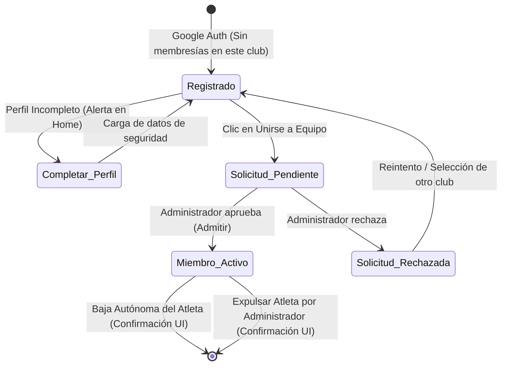
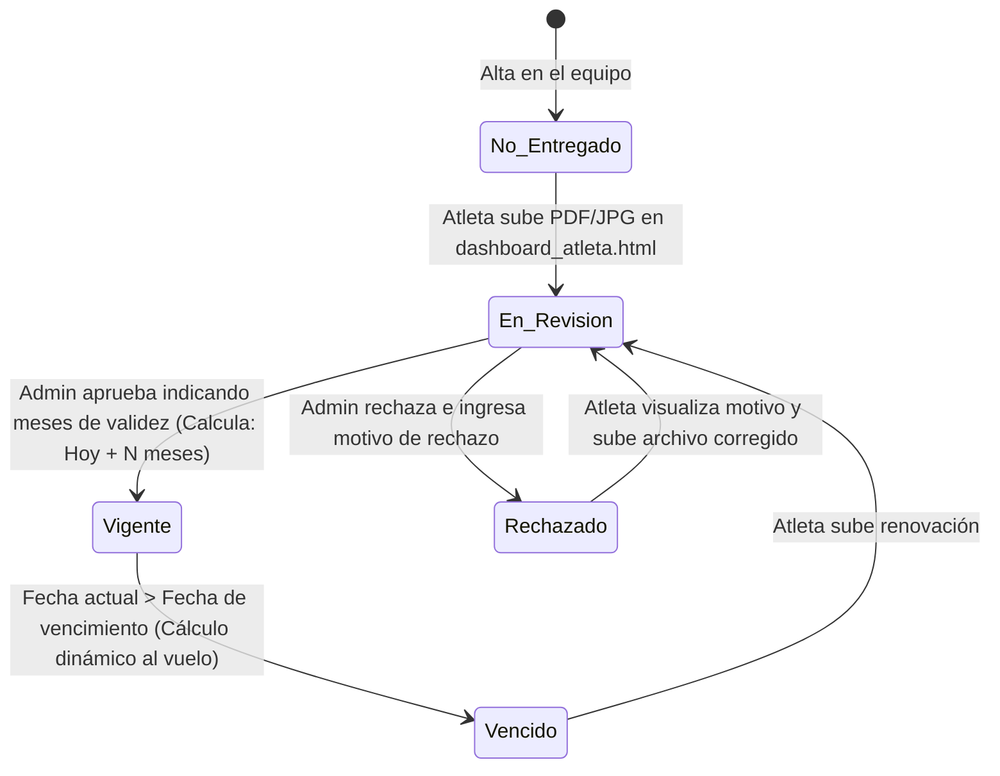
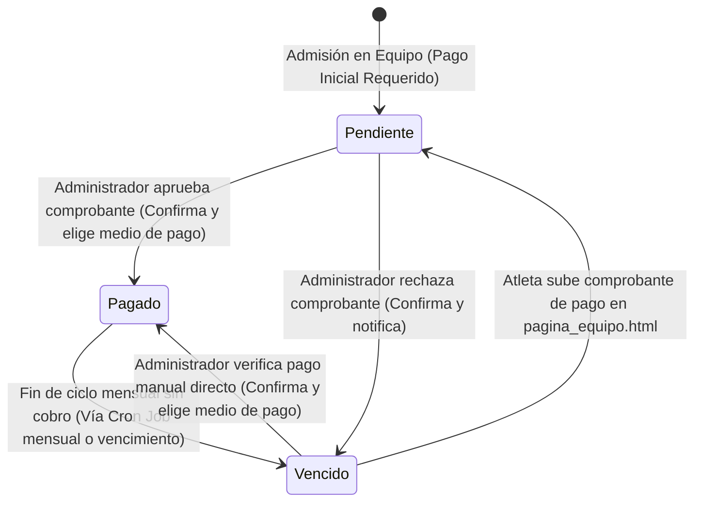

# Stride — Diagrama Técnico de Flujos de Usuario (User Flows)

Este documento contiene la especificación de flujo unificada para la plataforma **Stride**. Integra el frontend del atleta, el backend/base de datos y el panel del administrador en un diagrama único y profundo que describe la arquitectura del sistema, el ciclo de vida de los datos y las transiciones de estado.

---

## 🗺️ Diagrama de Flujo Unificado y Profundo

Este diagrama representa las interacciones de punta a punta entre los **Atletas**, el **Sistema central (Backend/DB)** y el **Administrador (SaaS)**.

```mermaid
graph TD
    %% Definición de estilos CSS
    classDef atleta fill:#1A3834,stroke:#FBFAF4,stroke-width:2px,color:#FBFAF4;
    classDef admin fill:#FF5A1F,stroke:#1A3834,stroke-width:2px,color:#FBFAF4;
    classDef backend fill:#1A2B42,stroke:#FBFAF4,stroke-width:1.5px,color:#FBFAF4;
    classDef decision fill:#FBFAF4,stroke:#1A3834,stroke-width:2px,color:#1A3834;
    classDef estado fill:#F5F3EB,stroke:#FF5A1F,stroke-width:1px,color:#1A3834;

    %% --- SUBGRAFO: ATLETA (FRONTEND) ---
    subgraph Atleta ["🏃‍♂️ CAPA ATLETA (FRONTEND)"]
        A1["Landing Page acceso_plataforma.html"]:::atleta
        A2("Hacer clic en 'Continuar con Google'"):::atleta
        A3["Home Principal home_principal.html"]:::atleta
        A4["Explorador de Equipos explorador_equipos.html"]:::atleta
        A5("Clic en 'Solicitar Unirse'"):::atleta
        A6["Modal/Banner: popup_datos_atleta.html"]:::atleta
        A7("Completar Perfil de Seguridad"):::atleta
        A8["explorador_equipos.html (Estado: Solicitud Enviada)"]:::atleta
        A9["Página de Club pagina_equipo.html"]:::atleta
        A10["Mi perfil dashboard_atleta.html"]:::atleta
        A11("Subir Archivo PDF/JPG (Apto Médico)"):::atleta
        A12["pagina_equipo.html (Pestaña Suscripción)"]:::atleta
        A13("Subir Comprobante de Pago (PDF/JPG)"):::atleta
        A14("Clic en 'Darse de Baja' (Confirma en UI)"):::atleta
        A15("Editar Datos de Seguridad (Global)"):::atleta
    end

    %% --- SUBGRAFO: BACKEND & DATABASE ---
    subgraph Backend ["🖥️ CAPA SISTEMA (BACKEND & DATABASE)"]
        S1["Autenticación Google OAuth API"]:::backend
        S2{"¿Email registrado en DB?"}:::decision
        S3["Crear registro en DB <br>(Nombre, Email) <br> Estado de Membresías: 'Vacío'"]:::backend
        S4["Iniciar Sesión de Atleta <br>(Generar Token JWT y verificar Roles)"]:::backend
        S5{"¿Atleta tiene <br> Teléfono, Nac. <br> y Emergencia en DB?"}:::decision
        S6["Guardar datos de seguridad globalmente <br> en Perfil de Usuario"]:::backend
        S7{"¿Estado de Solicitud <br> de Club en DB?"}:::decision
        S8["Registrar Solicitud de Club <br> Estado Solicitud: 'Pendiente'"]:::backend
        S9["Almacenar Certificado Médico <br>(Cloud Storage & URL en DB) <br> Estado Apto: 'En Revisión'"]:::backend
        S10["Crear Relación Atleta-Equipo <br> Estado Solicitud: 'Aprobada' <br> Membresía: 'Activo' <br> Estado Pago: 'Pendiente'"]:::backend
        S11["Actualizar Relación Atleta-Equipo <br> Estado Solicitud: 'Rechazada'"]:::backend
        S12["Almacenar Comprobante de Pago <br>(Cloud Storage) <br> Estado Pago: 'Pendiente'"]:::backend
        S13["Actualizar Estado de Pago <br> Estado Pago: 'Pagado' <br> Guardar Medio de Pago (Efectivo/Transfer/etc.)"]:::backend
        S14["Actualizar Estado de Apto <br> Calcular vencimiento (hoy + N meses) <br> Estado Apto: 'Vigente' <br> (Vencimiento dinámico al vuelo)"]:::backend
        S15["Actualizar Estado de Apto <br> Estado Apto: 'Rechazado' <br> Guardar Motivo de Rechazo"]:::backend
        S16["Actualizar Estado de Pago <br> Estado Pago: 'Vencido' <br> (Vía Cron Job mensual o Rechazo)"]:::backend
        S17["Registrar desvinculación <br> Estado Membresía: 'Inactivo'"]:::backend
        S18["Actualizar Perfil de Seguridad <br> (Global - Sin Notificaciones)"]:::backend
    end

    %% --- SUBGRAFO: ADMINISTRADOR (FRONTEND) ---
    subgraph Admin ["💼 CAPA ADMINISTRADOR (FRONTEND)"]
        AD1["Landing Page acceso_plataforma.html"]:::admin
        AD2("Hacer clic en 'Continuar con Google'"):::admin
        AD4["Dashboard Principal Admin admin_dashboard.html"]:::admin
        AD5{"¿Admitir o Rechazar Solicitud?"}:::decision
        AD6["Tabla: Atletas y Suscripciones (admin_dashboard.html)"]:::admin
        AD7("Auditar Pago: Comprobante y selector de medio de pago"):::admin
        AD12{"¿Aprobar o Rechazar Pago?"}:::decision
        AD8("Marcar como 'Pagado' (Elegir método)"):::admin
        AD13("Hacer clic en 'Rechazar Pago'"):::admin
        AD9["Tabla: Aptos Médicos (admin_dashboard.html)"]:::admin
        AD10{"¿Aprobar o Rechazar Certificado?"}:::decision
        AD11("Configurar vigencia del Apto: Selector 1 a 12 meses"):::admin
        AD15("Ingresar motivo de rechazo de Apto"):::admin
        AD16("Clic en 'Expulsar / Dar de Baja' (Confirma en UI)"):::admin
    end

    %% --- FLUJO DE CONEXIÓN ---
    
    %% Flujo 1: Acceso del Atleta
    A1 --> A2
    A2 --> S1
    S1 --> S2
    S2 -- No --> S3
    S3 --> S4
    S2 -- Sí --> S4
    S4 --> S5
    
    %% Flujo 3: Evaluación de Datos del Atleta (Onboarding en Home)
    S5 -- No --> A6
    A6 --> A7
    A7 --> S6
    S6 --> A3
    S5 -- Sí --> A3
    
    %% Flujo 2: Navegación & Selección de Equipo
    A3 --> |"Ir a Equipos"| A4
    A4 --> A5
    A5 --> S8
    S8 --> A8

    %% Sincronización 1: El Atleta espera a que el Administrador actúe
    A8 --> S7
    S7 -- Pendiente --> A8
    S7 -- Aprobada --> A9
    
    %% Flujo de Baja Autónoma del Atleta
    A9 --> A14
    A14 --> S17
    S17 -.-> |"Membresía: Inactiva"| S7
    
    %% Edición global silenciosa de datos de seguridad
    A10 --> A15
    A15 --> S18
    S18 --> A10

    %% Flujo 4: Acceso y Control del Administrador
    AD1 --> AD2
    AD2 --> S1
    S1 --> S4
    S4 --> |"Si tiene rol Admin"| AD4
    
    %% Sincronización 2: El Administrador resuelve la solicitud del Atleta
    S6 -.-> |"Disparador: <br> Nueva Solicitud en DB"| AD4
    S8 -.-> |"Disparador: <br> Nueva Solicitud en DB"| AD4
    
    AD4 --> |"Pestaña Solicitudes"| AD5
    AD5 -- Admitir --> S10
    AD5 -- Rechazar --> S11
    S10 -.-> |"Notificación / Refresco de Estado"| S7
    
    %% Flujo 5: Gestión de Suscripciones por el Administrador
    AD4 --> |"Pestaña Atletas"| AD6
    A9 --> |"Renovar cuota"| A12
    A12 --> A13
    A13 --> S12
    S12 -.-> |"Disparador: Pago Pendiente"| AD6
    AD6 --> AD7
    AD7 --> AD12
    AD12 -- Aprobar --> AD8
    AD12 -- Rechazar --> AD13
    AD8 --> S13
    AD13 --> S16
    S13 -.-> |"Reflejo de Pago Exitoso (Pagado)"| A12
    S16 -.-> |"Reflejo de Pago Fallido (Vencido)"| A12
    
    %% Expulsión por Administrador
    AD6 --> AD16
    AD16 --> S17
    
    %% Flujo 6: Carga de Apto Médico por el Atleta
    A10 --> A11
    A11 --> S9
    
    %% Sincronización 3: Auditoría Médica por el Administrador
    S9 -.-> |"Disparador: Apto en 'En Revisión'"| AD9
    AD4 --> |"Pestaña Aptos"| AD9
    AD9 --> AD10
    AD10 -- Aprobar --> AD11
    AD11 --> S14
    AD10 -- Rechazar --> AD15
    AD15 --> S15
    S14 -.-> |"Cambio a Vigente en UI"| A10
    S15 -.-> |"Cambio a Rechazado (Muestra Motivo) en UI"| A10
end
```

---

## 🔄 Estados de Base de Datos y Ciclos de Vida

El backend de Stride opera bajo tres ciclos de vida de estado independientes por cada relación atleta-club.

### 1. Ciclo de Vida de la Membresía del Atleta (Relación Atleta-Equipo)

Un atleta puede pertenecer a múltiples equipos en paralelo. En cada uno, la membresía mantiene su propio estado lógico:



### 2. Ciclo de Vida del Apto Médico (Certificado Relacional)

El apto médico vive en el perfil del atleta, pero es auditado de forma independiente por el administrador de cada club al que pertenece. La vigencia calculada es variable (de 1 a 12 meses):



### 3. Ciclo de Vida de la Suscripción (Pagos del Club)

El ciclo de facturación es particular de cada relación Atleta-Club y gestiona los estados de cobro del mes corriente:



---

## 🚦 Gestión de Excepciones y Flujos Alternos

1. **Fallo en Google Auth:**
   * **Problema:** El usuario cancela la selección de cuenta de Google o la API externa no responde.
   * **Resolución:** El frontend atrapa la promesa fallida del SDK de Google, no realiza ninguna petición al backend y permanece en [acceso_plataforma.html](file:///c:/Users/pnm19/OneDrive/Documents/stride/Wireframes%20UI/acceso_plataforma.html) permitiéndole reintentar.

2. **Formulario de Seguridad Incompleto:**
   * **Problema:** El Atleta intenta navegar o unirse a un club sin datos de seguridad mínimos.
   * **Resolución:** El backend realiza validaciones estrictas a nivel de API (validación de esquemas). Si los campos obligatorios están ausentes o vacíos en el perfil al iniciar sesión en el Home, la API de perfil general indica que está incompleto y el frontend abre el banner/modal de onboarding [popup_datos_atleta.html](file:///c:/Users/pnm19/OneDrive/Documents/stride/Wireframes%20UI/popup_datos_atleta.html).

3. **Rechazo de Documento Médico con Motivo:**
   * **Problema:** Un atleta sube un PDF vacío o una foto borrosa.
   * **Resolución:** El administrador presiona "Rechazar" en el panel. El sistema le solicita ingresar un breve motivo de rechazo (ej. "Falta sello de la clínica"). El backend cambia el estado a `Rechazado` y almacena el motivo. El atleta visualiza el motivo en color rojo en la pestaña *Mi perfil* de [dashboard_atleta.html](file:///c:/Users/pnm19/OneDrive/Documents/stride/Wireframes%20UI/dashboard_atleta.html) y puede corregir la carga.

4. **Persistencia en Estado Vencido de Cobro (Actualización Automática):**
   * **Problema:** El atleta acumula facturas sin pagar o su comprobante es rechazado.
   * **Resolución:** Un Cron Job del sistema actualiza las cuotas no pagadas al estado `Vencido` al finalizar el ciclo. El atleta visualiza en su pestaña *Mi Suscripción* en [pagina_equipo.html](file:///c:/Users/pnm19/OneDrive/Documents/stride/Wireframes%20UI/pagina_equipo.html) un banner con advertencia en color rojo y el cargador de comprobante habilitado.

5. **Rechazo de Comprobante de Pago por el Administrador:**
   * **Problema:** El atleta carga un archivo incorrecto o inválido como comprobante.
   * **Resolución:** El administrador hace clic en "Rechazar Pago" (previa confirmación por pop-up). El backend cambia el estado del cobro a `Vencido` e invalida el comprobante actual. El atleta verá en su pestaña *Mi Suscripción* el estado de deuda y una alerta indicando que su comprobante fue rechazado, solicitando una nueva carga.

6. **Edición Global de Perfil de Seguridad (Silenciosa):**
   * **Problema:** El atleta desea actualizar su teléfono o contacto de emergencia.
   * **Resolución:** El atleta realiza la edición desde `dashboard_atleta.html`. Los datos se guardan en su perfil global en la DB. Como es un cambio de perfil estándar, el sistema no emite alertas o notificaciones a los administradores de los clubes a los que está unido.
